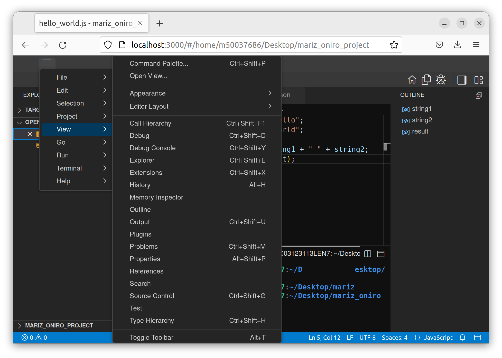

# User Interface

At its heart, Oniro IDE is a code editor. Like many other code editors, Oniro IDE adopts a common user interface and layout of an explorer on the left, showing all of the files and folders you have access to, and an editor on the right, showing the content of the files you have opened.

## Basic Layout
The basic layout consists of 8 main areas:
1. **Menu Bar**: that contains the main menus such as File, Edit, View, Run..etc.
1. **Tool Bar**: for going home, and toggling the explorer and debugging side bars.
1. **Layout Bar**: for changing the layout and positioning of the tool bar.
1. **Editor Groups**: with all the different files you are editing. You open as many files as you want and stack them horizontally and vertically.
1. **Primary Side Bar**: usually hosts the `Explorer` view to assist you to navigate and work on your project.
1. **Panel**: space for views below the editor area. It typically has the integrated terminal, output and errors. You can also stack multiple views in the panel or have it as a pop out in a separate window.
1. **Status Bar**: shows the status of the file you are currently editing such as the language used in the file.
1. **Secondary Side Bar**: hosts an extra view on the right hand side such as a `Debugging` side bar.

## Explorer
The explorer is used to browse, open, and manage all the files and folders in your project. You can create a new file or folder at any time in your project. You can also switch to a different project previously opened in the IDE by selecting it from the active project menu.

You can do many things to files and folders in the explorer:

* Create, delete, rename files and folders by right click.
* Move files and folders by drag and drop.
* Duplicate, copy and paste files into a folder.

{: .note }
> You could run commands in a folder by right clicking on the folder itself or a file in the folder and choosing `Open in Terminal` from the pop out menu.

### Open Editors
On the top of the `Explorer` side view you can find a pane called `Open Editors` this shows all the files that you currently have open. This allows for quick navigation between the opened editor tabs.

## Views

The `Explorer` is one of multiple other views available in Oniro IDE. 

By navigating to `View` from the menu bar you could see the different views that can be opened such as:
* **Search** Provides global search and replace across your open folder.
* **Debug** for debugging tools displaying the `Call Stack`, `Variables`, `Breakpoints` throughout the code, and a `Watch` monitoring select variables.
* **Outline** shows a symbol tree of the currently active editor showing the variables in your code.

